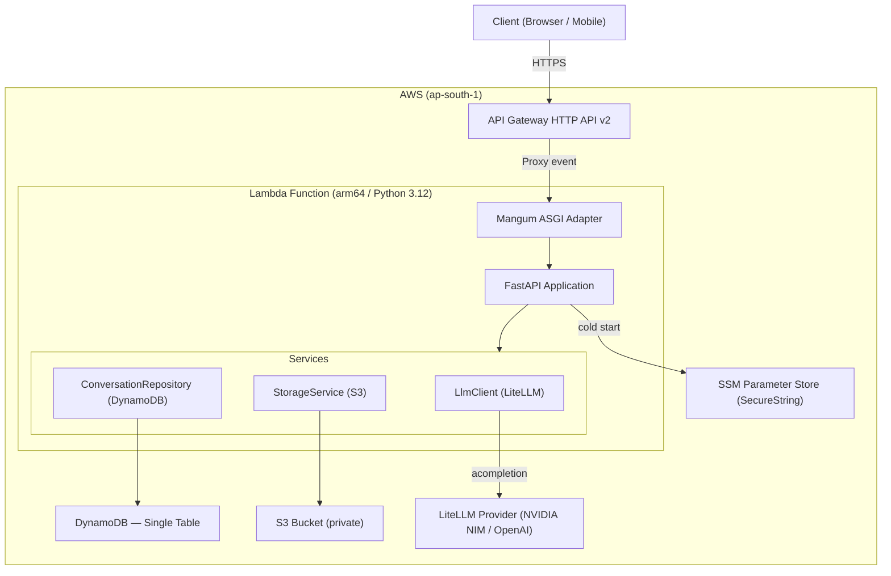
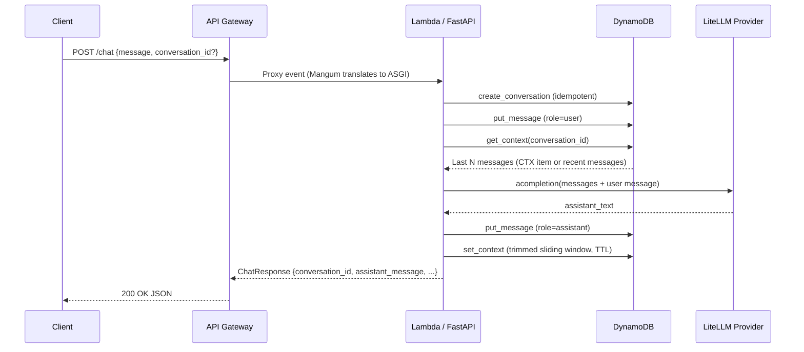
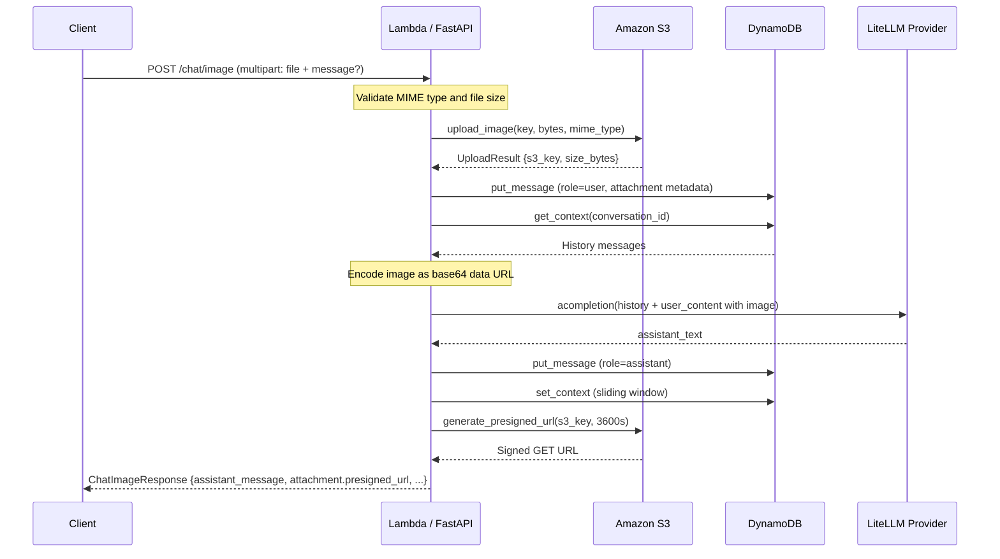

# chatbot-aws

A fully serverless chatbot API built with FastAPI and deployed on AWS Lambda via AWS SAM. Supports both text and multimodal (image + text) conversations, with persistent history in DynamoDB, private image storage in S3, and encrypted API key management through SSM Parameter Store. Runs on any provider supported by LiteLLM — OpenAI, Anthropic, NVIDIA NIM, and more.

---

## Architecture Overview

The entire application runs inside a single Lambda function. API Gateway HTTP API (v2) proxies all HTTP traffic to the Lambda, where [Mangum](https://github.com/jordaneremieff/mangum) translates the raw Lambda event into the ASGI format that FastAPI understands. All AWS infrastructure — Lambda, API Gateway, DynamoDB, and S3 — is declared in a single SAM template and deployed in one command.



### AWS Services Used

| Service | Purpose | Free Tier |
|---|---|---|
| API Gateway HTTP API v2 | HTTPS entrypoint | 1M req/month |
| Lambda (arm64 Graviton) | Runs FastAPI | 1M req + 400K GB-sec/month |
| DynamoDB (PAY_PER_REQUEST) | Conversation history + TTL context | 25 GB storage |
| S3 | Private image attachment storage | 5 GB |
| SSM Parameter Store | Encrypted LLM API key | 10K standard params |

---

## Key Features

- **Text chat** — `POST /chat` accepts a JSON message and returns an LLM-generated reply.
- **Multimodal image chat** — `POST /chat/image` accepts a `multipart/form-data` upload (PNG, JPEG, WebP ≤ 5 MB) and sends the image inline to a vision-capable model.
- **Persistent conversation history** — messages are stored in DynamoDB and loaded per `conversation_id` on every request.
- **Sliding context window** — a dedicated `CTX` item caches the last N messages as JSON for fast retrieval. It expires automatically via DynamoDB TTL (default 1 hour).
- **Private S3 image storage** — uploaded images are never public; access is granted via signed GET URLs (1-hour expiry) returned in the response.
- **Secure secrets** — the LLM API key is stored as a KMS-encrypted SSM `SecureString` and decrypted at cold start, never exposed as a plain-text environment variable.
- **Provider-agnostic LLM routing** — LiteLLM lets you change the model and base URL (e.g., NVIDIA NIM, OpenAI) without touching application code.
- **Graceful error handling** — all unhandled exceptions are caught and returned as a structured JSON `error` field; no naked 500s.
- **Structured logging** — single-line log format compatible with CloudWatch; level controlled via `LOG_LEVEL` env var.
- **Local development** — runs with `uvicorn` using the same `.env` file; optional local overrides for DynamoDB Local and Minio.

---

## Tech Stack

| Layer | Technology |
|---|---|
| Language | Python 3.12 |
| Web framework | FastAPI |
| ASGI adapter | Mangum |
| LLM routing | LiteLLM |
| Settings | pydantic-settings |
| AWS SDK | boto3 |
| Package manager | uv |
| Infrastructure | AWS SAM (CloudFormation) |
| Compute | AWS Lambda (arm64) |
| Database | Amazon DynamoDB |
| Object storage | Amazon S3 |
| Secret management | AWS SSM Parameter Store |
| Testing | pytest, pytest-asyncio, httpx |
| Local dev server | uvicorn |

---

## Project Structure

```
chatbot-aws/
├── template.yaml          # AWS SAM IaC: Lambda, API GW, DynamoDB, S3, IAM policies
├── samconfig.toml         # Saved sam deploy settings (stack name, region, params)
├── .env.example           # Template for local .env
├── AGENTS.md              # Engineering standards and project conventions
├── ARCHITECTURE.md        # Deep-dive architecture and change log
│
└── backend/
    ├── pyproject.toml     # Python project metadata and dependencies (uv)
    ├── requirements.txt   # Flat requirements exported for SAM Docker build
    │
    └── app/
        ├── main.py            # FastAPI app init, Mangum handler, /health endpoint
        ├── settings.py        # Pydantic settings loaded from env vars / .env
        ├── dependencies.py    # FastAPI dependency providers: DynamoDB, S3, SSM, LLM
        ├── logging_config.py  # Root logger setup; CloudWatch-compatible format
        │
        ├── api/
        │   └── routes.py      # POST /chat and POST /chat/image handlers
        │
        ├── models/
        │   └── schemas.py     # Pydantic request/response schemas
        │
        ├── repositories/
        │   └── conversation_repository.py  # DynamoDB single-table read/write
        │
        ├── services/
        │   ├── llm.py         # Async LiteLLM completion wrapper
        │   ├── storage.py     # S3 upload + presigned URL generation
        │   └── prompt.py      # History and multimodal content builders
        │
        ├── utils/
        │   └── time.py        # UTC timestamp helpers
        │
        └── tests/
            ├── conftest.py    # Pytest fixtures: stubs for LLM, DynamoDB, S3
            └── test_chat.py   # Integration tests for /chat and /chat/image
```

---

## Logic Flows

### Text Chat Request (`POST /chat`)



### Image Chat Request (`POST /chat/image`)



### DynamoDB Single-Table Schema

| Item | `pk` | `sk` |
|---|---|---|
| Conversation metadata | `CONV#<id>` | `META` |
| User / assistant message | `CONV#<id>` | `MSG#<timestamp>#<message_id>` |
| Context window (TTL) | `CONV#<id>` | `CTX` |

---

## Installation & Setup

### Prerequisites

- Python 3.12+, [`uv`](https://github.com/astral-sh/uv)
- AWS CLI v2, [AWS SAM CLI](https://docs.aws.amazon.com/serverless-application-model/latest/developerguide/install-sam-cli.html)
- Docker (required for `sam build --use-container`)

### Local Development

```bash
# 1. Clone the repo
git clone <repo-url>
cd chatbot-aws

# 2. Install dependencies
cd backend
uv sync

# 3. Configure environment
cp .env.example .env
# Edit .env — set AWS credentials, DynamoDB/S3 endpoints for local infra,
# and your LITELLM_API_KEY / LITELLM_MODEL

# 4. Start the API
uv run uvicorn app.main:app --reload --port 8080
```

The API will be available at `http://localhost:8080`. The interactive docs are at `http://localhost:8080/docs`.

### Running Tests

```bash
cd backend
uv run pytest tests/ -v
```

---

## Deployment

### First-time Setup

```bash
# 1. Store your LLM API key in SSM Parameter Store
aws ssm put-parameter \
  --name "/chatbot/litellm_api_key" \
  --type "SecureString" \
  --value "nvapi-..." \
  --overwrite

# 2. Generate a SAM-compatible flat requirements file
cd backend
uv export --format requirements-txt --no-hashes --no-emit-project -o requirements.txt
cd ..

# 3. Build and deploy (guided prompts save settings to samconfig.toml)
sam build --use-container
sam deploy --guided
```

### Subsequent Deployments

```bash
cd backend && uv export --format requirements-txt --no-hashes --no-emit-project -o requirements.txt && cd ..
sam build --use-container
sam deploy
```

### Retrieve the deployed API URL

```bash
aws cloudformation describe-stacks \
  --stack-name chat \
  --query "Stacks[0].Outputs[?OutputKey=='ApiUrl'].OutputValue" \
  --output text
```

---

## Usage Examples

### Health check

```bash
curl https://<api-id>.execute-api.<region>.amazonaws.com/health
# {"status":"ok"}
```

### Send a text message

```bash
curl -X POST https://<api-id>.execute-api.<region>.amazonaws.com/chat \
  -H "Content-Type: application/json" \
  -d '{"message": "What is the capital of France?", "user_id": "alice"}'
```

```json
{
  "conversation_id": "3f8a2b1c-...",
  "user_message_id": "a1b2c3...",
  "assistant_message_id": "d4e5f6...",
  "assistant_message": "The capital of France is Paris.",
  "created_at": "2026-05-23T10:00:00Z",
  "error": null
}
```

### Continue a conversation

```bash
curl -X POST https://<api-id>.execute-api.<region>.amazonaws.com/chat \
  -H "Content-Type: application/json" \
  -d '{"message": "What language do they speak there?", "conversation_id": "3f8a2b1c-..."}'
```

### Send an image

```bash
curl -X POST https://<api-id>.execute-api.<region>.amazonaws.com/chat/image \
  -F "file=@screenshot.png" \
  -F "message=Describe what you see" \
  -F "conversation_id=3f8a2b1c-..."
```

```json
{
  "conversation_id": "3f8a2b1c-...",
  "assistant_message": "The image shows a terminal window with...",
  "attachment": {
    "s3_key": "3f8a2b1c-.../a1b2c3....png",
    "mime_type": "image/png",
    "size_bytes": 45000,
    "presigned_url": "https://chatbot-uploads-....s3.amazonaws.com/...?X-Amz-Signature=..."
  },
  "error": null
}
```

### Update the LLM API key without redeploying

```bash
aws ssm put-parameter \
  --name "/chatbot/litellm_api_key" \
  --type "SecureString" \
  --value "new-api-key" \
  --overwrite
# Invoke a new Lambda cold start (e.g., change any env var) to pick up the new key.
```

### Tail live Lambda logs

```bash
sam logs -n ChatbotBackendFunction --stack-name chat --tail
```

### Tear down all infrastructure

```bash
sam delete
# Deletes: Lambda, API Gateway, DynamoDB table (+ all data), S3 bucket (+ all images), IAM role.
# Does NOT delete: SSM parameter, SAM-managed S3 artifact bucket.
```

---

## Configuration Reference

All settings are loaded by `pydantic-settings` from environment variables (or `.env` locally). In production, they are injected by CloudFormation via `template.yaml`.

| Variable | Default | Description |
|---|---|---|
| `AWS_REGION` | `us-east-1` | AWS region (set automatically by Lambda runtime) |
| `DYNAMODB_TABLE_NAME` | `chatbot` | DynamoDB table name |
| `DYNAMODB_ENDPOINT_URL` | _(none)_ | Override for DynamoDB Local |
| `S3_BUCKET_NAME` | `chatbot-uploads` | S3 bucket name |
| `S3_ENDPOINT_URL` | _(none)_ | Override for local Minio |
| `S3_FORCE_PATH_STYLE` | `false` | Enable path-style S3 URLs (required for Minio) |
| `LITELLM_MODEL` | `gpt-4o-mini` | LiteLLM model string |
| `LITELLM_API_KEY` | _(none)_ | API key for local dev (overridden by SSM in production) |
| `LITELLM_BASE_URL` | _(none)_ | Custom base URL (e.g., NVIDIA NIM) |
| `LITELLM_API_KEY_PARAMETER` | _(none)_ | SSM parameter path for the encrypted API key |
| `CONTEXT_TTL_SECONDS` | `3600` | Seconds before the context window item expires in DynamoDB |
| `MAX_HISTORY_MESSAGES` | `10` | Maximum messages kept in the sliding context window |
| `MAX_IMAGE_BYTES` | `5242880` | Maximum image upload size (5 MB) |
| `ALLOWED_IMAGE_MIME_TYPES` | `image/png,image/jpeg,image/webp` | Comma-separated list of accepted MIME types |
| `LOG_LEVEL` | `INFO` | Python logging level (`DEBUG`, `INFO`, `WARNING`, `ERROR`) |
