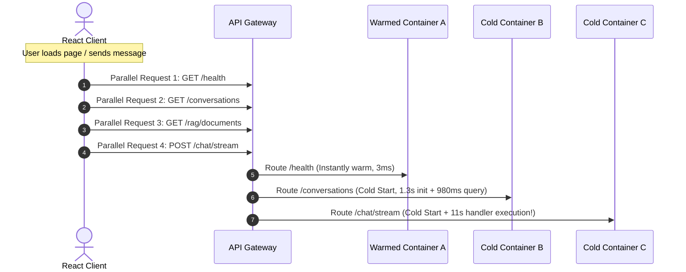
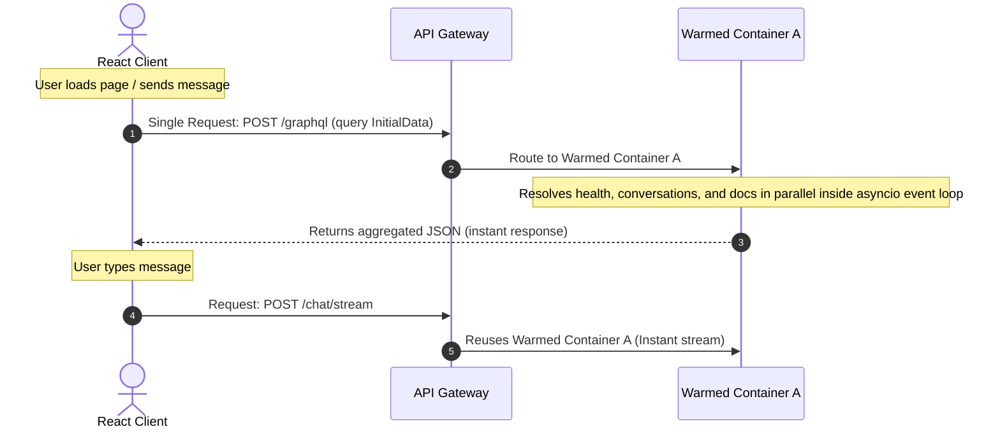

# GraphQL Concurrency & Serverless Cold Start Optimization

This document outlines the architecture to migrate the Chatbot application's initial data-loading and standard query/mutation operations (such as fetching messages, renaming/deleting conversations, and RAG document management) to **GraphQL**. This change resolves the serverless **concurrency cold start wave** that occurs when a REST client boots and makes multiple parallel API requests.

---

## 1. Executive Summary

In traditional containerized environments (ECS, EC2, Kubernetes), servers handle hundreds of concurrent requests on a single instance using multithreading.

In AWS Lambda, execution environments are strictly **single-concurrency**. Each active container handles only **one request at a time**.

When our REST client boots, it dispatches 5+ API requests in parallel. Even if we pre-warm one container, the remaining concurrent requests force AWS Lambda to scale out and spin up multiple new containers. If the primary chat stream request lands on one of these cold containers, the user experiences a cold start delay. By consolidating startup operations into a single GraphQL query, we reduce app initialization concurrency to exactly **1 request**, ensuring the pre-warmed container is reused perfectly.

---

## 2. The REST Concurrency Wave vs. GraphQL Single-Query

### 2.1. The REST Concurrency Wave (Current Behavior)



- **Result:** Because requests 2, 3, and 4 arrive while Container A is busy, AWS Lambda immediately scales out. The user's chat request hits a brand-new container, suffering a cold start.

---

### 2.2. The GraphQL Single-Query (Implemented Behavior)



- **Result:** Since only a single consolidated request is sent during page initialization, it easily fits into the pre-warmed container. Subsequent user interactions reuse the same container, maintaining **0ms cold start latency**.

---

## 3. Implemented Backend Architecture

We can use **Strawberry GraphQL**, a modern, type-safe Python GraphQL library built on top of dataclasses and Pydantic, which integrates seamlessly with FastAPI.

### 3.1. Schema Design (strawberry Types)

```python
import strawberry
from typing import List, Optional

@strawberry.type
class HealthStatus:
    status: str

@strawberry.type
class Conversation:
    id: str
    name: str
    created_at: str

@strawberry.type
class RagDocument:
    document_id: str
    filename: str
    tags: List[str]

@strawberry.type
class Query:
    @strawberry.field
    async def health(self) -> HealthStatus:
        return HealthStatus(status="ok")

    @strawberry.field
    async def conversations(self, info) -> List[Conversation]:
        # Access database repository
        repo = info.context["repo"]
        user_id = info.context["user_id"]
        items = await repo.get_conversations(user_id)
        return [Conversation(id=i["id"], name=i["name"], created_at=i["created_at"]) for i in items]

    @strawberry.field
    async def rag_documents(self, info) -> List[RagDocument]:
        vector_store = info.context["vector_store"]
        user_id = info.context["user_id"]
        docs = await vector_store.list_documents(user_id)
        return [RagDocument(document_id=d["id"], filename=d["filename"], tags=d["tags"]) for d in docs]

schema = strawberry.Schema(query=Query)
```

### 3.2. Mounting in FastAPI

We mount the router under a single `/graphql` endpoint in `app/main.py`:

```python
from strawberry.fastapi import GraphQLRouter
from app.dependencies import get_repository, get_vector_store

async def get_context(
    repo = Depends(get_repository),
    vector_store = Depends(get_vector_store),
    user_id: str = Depends(get_current_user_id)
):
    return {
        "repo": repo,
        "vector_store": vector_store,
        "user_id": user_id
    }

graphql_app = GraphQLRouter(schema, context_getter=get_context)
app.include_router(graphql_app, prefix="/graphql")
```

---

## 4. Implemented Frontend Architecture

We do not need heavy GraphQL libraries like Apollo or Relay. The standard browser `fetch` API is more than sufficient.

```typescript
interface InitialDataResponse {
  data: {
    health: { status: string };
    conversations: Array<{ id: string; name: string }>;
    documents: Array<{ id: string; filename: string }>;
  };
}

export async function fetchInitialData(
  apiBaseUrl: string,
  token: string,
): Promise<InitialDataResponse> {
  const query = `
    query GetInitialData {
      health {
        status
      }
      conversations {
        id
        name
      }
      documents {
        document_id
        filename
      }
    }
  `;

  const response = await fetch(`${apiBaseUrl}/graphql`, {
    method: "POST",
    headers: {
      "Content-Type": "application/json",
      Authorization: `Bearer ${token}`,
    },
    body: JSON.stringify({ query }),
  });

  return response.json();
}
```

---

## 5. Cost & Deployment Summary

- **Infrastructure Changes:** **None**. The GraphQL endpoint is simply a new route on the same FastAPI application.
- **Deployment Commands:** Built and deployed using existing commands:
  ```bash
  make deploy-backend
  ```
- **Warming Cost:** The EventBridge schedule pings `POST /graphql` with a lightweight `{ health { status } }` query once every 5 minutes. The monthly cost remains exactly **1.08 cents**.
- **Billed Duration:** Internal execution resolves DB queries in parallel, maintaining a single-digit millisecond response time once warmed.

---

## 6. Alternative: Sequential Frontend Request Chain

If migrating to GraphQL is not immediately desired due to development timelines, we can achieve the same **concurrency reduction** by refactoring the React frontend to run requests **sequentially** instead of concurrently:

```typescript
// Instead of parallel:
// const [health, convs, docs] = await Promise.all([fetchHealth(), fetchConvs(), fetchDocs()]);

// Run sequentially:
const health = await fetchHealth();
if (health.status === "ok") {
  const convs = await fetchConversations();
  const docs = await fetchDocuments();
}
```

- **Trade-off:** Sequential loading increases page-load time by the sum of individual database calls (~100ms - 200ms total), but completely resolves concurrent cold starts by reusing the same warmed Lambda container.

---

## 7. Extended Schema (Mutations and Messages)

The GraphQL schema has been extended beyond initial startup data to support all standard query/mutation operations of the application, eliminating the REST endpoints for:

- Fetching messages for a specific conversation
- Updating conversation names
- Deleting conversations
- Ingesting text RAG documents
- Deleting RAG documents

Binary and streaming payloads (such as SSE token streaming `POST /chat/stream` and physical document uploads `POST /rag/ingest/file` / `POST /chat/image`) remain on REST for maximum streaming efficiency and standard multipart processing.

### Extended Types

- `MessageItem` (with `AttachmentItem` and `CitationItem` lists)
- `DeleteConversationPayload`
- `DeleteRagDocumentPayload`
- `IngestRagTextPayload`

### Queries

- `conversationMessages(conversationId: String!)` -> Returns lists of messages.

### Mutations

- `updateConversationName(conversationId: String!, name: String!)`
- `deleteConversation(conversationId: String!)`
- `deleteRagDocument(documentId: String!)`
- `ingestRagText(filename: String!, content: String!, tags: [String!]!)`
